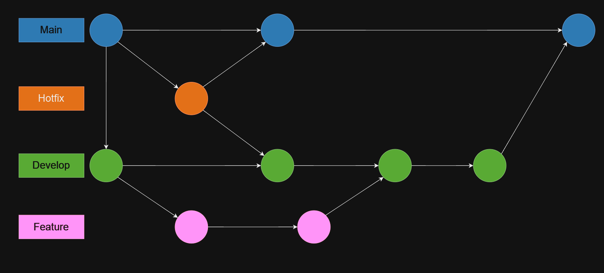

## Rapport

> de Maxime Masson et Mélène Dufrénois.

### Git

Pour notre projet, nous utilisons la manière **Trunk-based development** (TBD) où les branches features, fix, etc. sont mergées dans la branche `develop`. Chaque branche temporaire doit faire l’objet d’une **Pull Request** (PR) avant d’être mergée. Les branches créées doivent suivre une certaine mise en forme. Exemple :  `feature/nom-de-la-branche`.

Les **features** permettent d'ajouter des fonctionnalités, pour se faire (à partir de la branche develop) : 
- créer la branche avec `git checkout -b feature/nom-feature`
- pousser la branche sur le repo `git push --set-upstream origin develop`
- implémenter les fonctionnalités nécessaires, les vérifier, tester puis les push et faire une PR.
- une ./fois validée, la PR sera mergée à `develop` et déployée pour la validation finale
- une fois toutes les modifications de `develop` prêtes, elles seront mergées dans `main` et déployées en production.

Pour les **rollbacks**, nous revenons à la dernière version stable taguée dans Git et redéployons cette version en production.

Concernant les **hotfix**, comme pour les features, la branche doit se nommer `hotfix/nom-du-bug`. En revanche, elle peut être créée à partir de la branche main puisqu'elle doit être créée à partir du dernier tag stable.

---